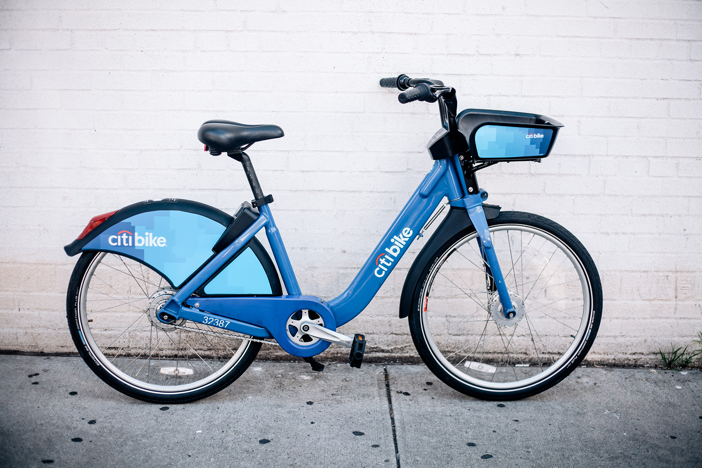
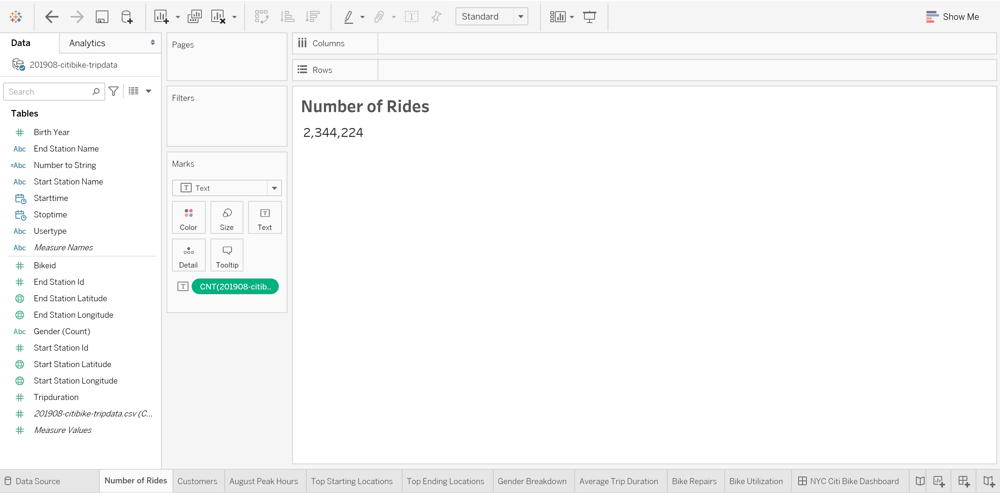
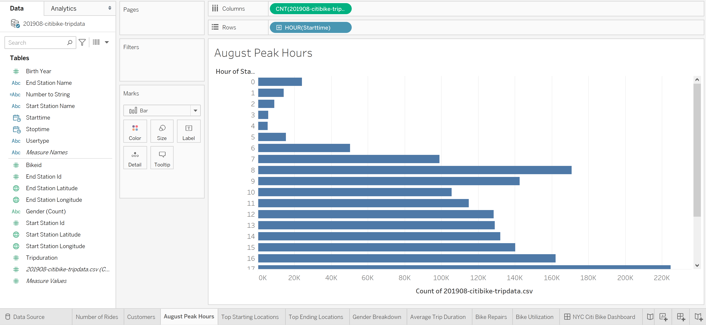
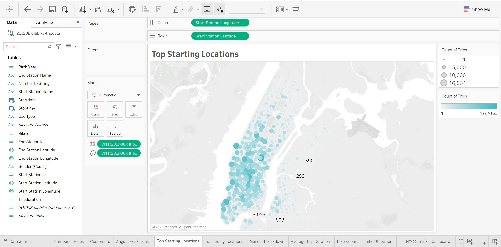
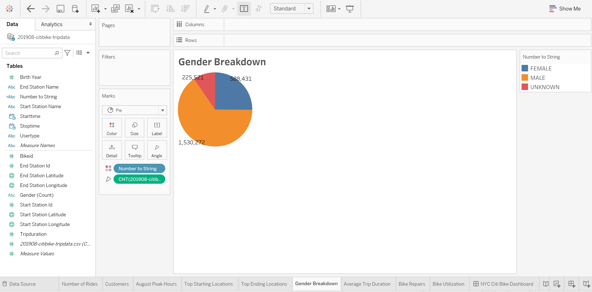

# Citi Bike Analysis

> Breakdown of Citi Bike's rider data in New York City from August 2019 for insights into bike usage into 2021.



## Overview of Project

Analyzed 9 Gigabytes of data from Citi Bike Trip Histories dataset. [Citi Bike Analysis Tableau](https://public.tableau.com/app/profile/sam4926/viz/BikeSharingChallengeModule14v1_0/UseractivitybyGender) was the foundation to which fed to a final analysis on User Type in times of COVID []() explaining their use patterns.

## Folder Structure

```
src/
├── data
│ ├── processed
│ │ └── NYC_Citibike_Processed_Data.csv
│ ├── 201908-citibike-tripdata.csv
│ ├── Images[...]
├── NYC_CitiBike_Challenge_starter_code.ipynb
└── README.md
```

## Analysis

We pulled Citi Bike's data using Python and Pandas to verify the available download sources, data modified, and size. Once we've cleaned up the raw data we did further analysis and visualization in Tableau. We started asking questions of the data on understanding Citi Bike's business, questions that would gve us insights in finding out the ride sharing number during the pandemic.

### Resources

Data sources are CSV files provided by [Citi Bike](https://www.citibikenyc.com/system-data) that lead you to their [Citi Bike Data download page](https://s3.amazonaws.com/tripdata/index.html).

The CSV file below is the data set used in the initial analysis project...

|               Name               |       Date Modified        |   Size    |   Type   |
| :------------------------------: | :------------------------: | :-------: | :------: |
| 201908-citibike-tripdata.csv.zip | Sep 18th 2019, 01:33:14 pm | 100.02 MB | ZIP file |

Analytic Visualization tool we used is Tableau Desktop: https://public.tableau.com/s/

The Data profile:

- Trip Duration (seconds)
- Start Time and Date
- Stop Time and Date
- Start Station Name
- End Station Name
- Station ID
- Station Lat/Long
- Bike ID
- User Type (Customer = 24-hour pass or 3-day pass user; Subscriber = Annual Member)
- Gender (Zero=unknown; 1=male; 2=female)
- Year of Birth

#### Results

The following questions were answered about the data using Tableau:

How many bike trips were recorded during the month of August?



We'll figure out the peak hours for bike trips during the month of August. This will help our investors get a ballpark estimate of how many bikes we might need in Des Moines. What Are Peak Riding Hours in the Month of August?



What are the highest-traffic locations? Understanding both when and where people use Citi Bike will help you plan your pilot in Des Moines.



What can the data tell us about the riders themselves? Often, the first place we start when understanding a population is gender.



While working with the data we found that the majority of clients were men.

## Todo Checklist

A helpful checklist to gauge how your README is coming on what I would like to finish:

- [ ] Fix and Update the styling of the Dashboards and Stories.
- [ ] Redo everything in Power BI.
