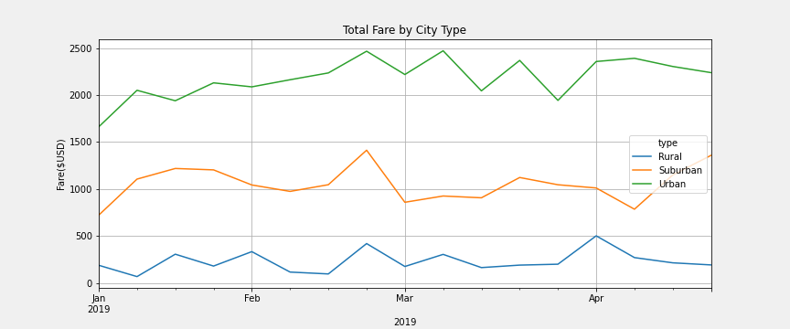
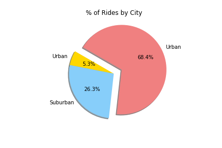
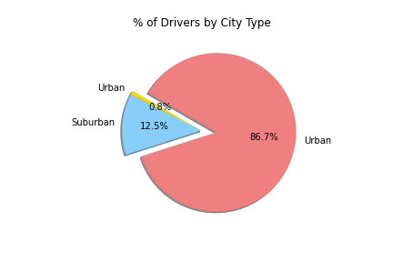
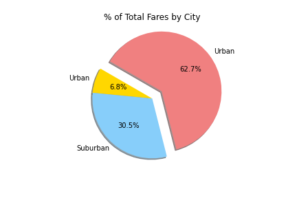

# PyBer Analysis

> Creating visualizations of ride-share data for PyBer to help improve access to ride-sharing services.

## Overview of Project

V. Isualize has given you and Omar a brand-new assignment. Using your Python skills and knowledge of Pandas, you’ll create a summary DataFrame of the ride-sharing data by city type. Then, using Pandas and Matplotlib, you’ll create a multiple-line graph that shows the total weekly fares for each city type. Finally, you’ll submit a written report that summarizes how the data differs by city type and how those differences can be used by decision-makers at PyBer.

## Summary

We ran the analysis and visualized some of the summaries for ride sharing. This multiple-line chart where each week is a peak or dip in the line graphs represent our DataFrame Summary.

### Resources

- Data Sources: city_data.csv/PyBer_ride_data.csv/ride_data.csv files
- Client Requirements from PyBer Company
- Software: Python 3.7.7, Anaconda, Jupyter Lab, Git 2.27
- Output Files: pyber.ipynb & PyBer_Challenge.ipynb

### Results / Analysis

We ran the analysis and visualized some of the summaries for ride sharing.

There are more rides in Urban cities than Suburban or Rural.

Percent of total drivers by city type follow the same pattern with more drivers being in Urban cities.

The average fare per ride with the average fare per driver are most expensive in the rural city type and less expensive in the urban city type. Yes, rural city type rides are higher; however, more fare dollars are made from urban city type fares.

Coming back to the multiple-line chart which presents three types of cities (Urban, Suburban, and Rural). Fares look consistent over time and even in their peaks and dips range. Note that the Urban brings in the most fare dollars, then Suburban, and then Rural. Our visualization figure five (Fig5.png) shows that Urban brings the total of rides BUT what length are all rides?

## Challenge Overview

This new assignment consists of two technical analysis deliverables and a written report to present your results. You will submit the following:

- Deliverable 1: A ride-sharing summary DataFrame by city type
- Deliverable 2: A multiple-line chart of total fares for each city type
- Deliverable 3: A written report for the PyBer analysis (README.md)

## Todo Checklist

A helpful checklist to gauge how your README is coming on what I would like to finish:

- [ ]

## Contributing

Pull requests are welcome. For major changes, please open an issue first to discuss what you would like to change.

Please make sure to update tests as appropriate.

## License

[MIT](https://choosealicense.com/licenses/mit/)
